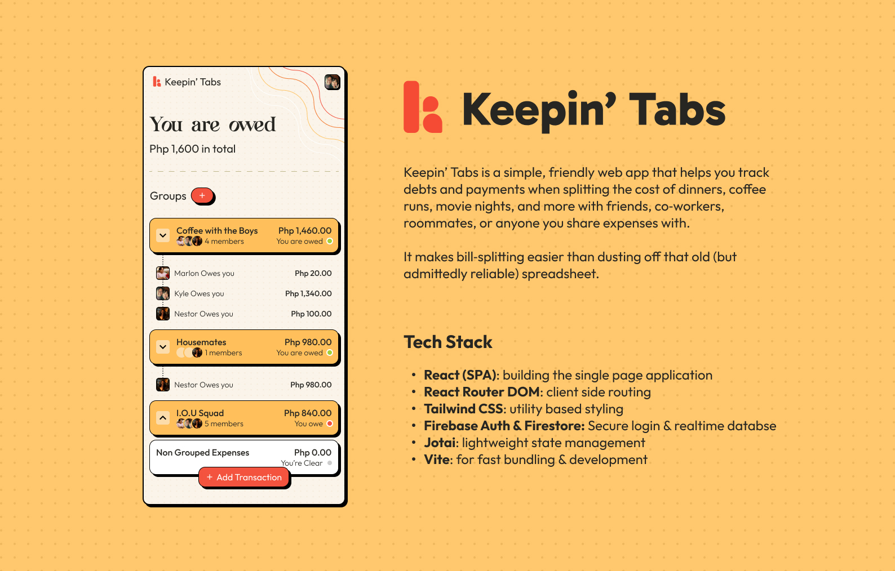

# 💸 Keepin Tabs

A debt bill splitting app designed to keep track of all members
overall debts to simplify splitting the bill and avoiding cyclical repayments!

## ✨ Overview

This project is a fully responsive website that keeps track of transactions
and splits the bill according to how much each member spent, or equally among all members.

## 🛠 Tech Stack

- React
- TypeScript
- Firebase
- Firestore
- Tailwind CSS

## 🎨 Features

- 🗠 Debt Simplification Rebalancing
- 😎 Group Tracking
- ✔️ Simple Transaction Adding
- 📱 Fully responsive design (mobile-first)
- ✨ Neu-Brutalist Style

## 📄 License

This project is for personal use.
